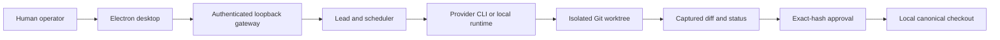

<p align="center">
  
</p>

<h1 align="center">Daimon OS</h1>

<p align="center"><strong>One local control plane for your coding agents.</strong></p>

<p align="center">
  Coordinate Claude Code, Codex, Gemini, Ollama, and LM Studio.<br>
  Isolate parallel work and review exact Git evidence before it reaches your canonical checkout.
</p>

<p align="center">
  <a href="LICENSE"></a>
  
  
  
</p>

<p align="center">
  <a href="#download">Download</a> ·
  <a href="#visual-product-tour">Product tour</a> ·
  <a href="#how-it-works">How it works</a> ·
  <a href="source/docs/END_TO_END_GUIDE.md">End-to-end guide</a> ·
  <a href="#build-from-source">Build</a>
</p>


> [!IMPORTANT]
> **Public build.** Daimon OS is free and open source under the [MIT License](LICENSE). Downloadable installers for macOS, Windows, and Linux are provided in this repository. They are currently unsigned; read the [artifact validation and platform caveats](app/README.md) before installing.

## Run a team, not a pile of terminals

Daimon OS is a single-operator Electron application for supervising coding-agent CLIs and local model runtimes already installed on your computer. It adds a structured operating layer around providers, agents, teams, projects, task graphs, isolated Git worktrees, human decisions, and exact-diff review.

There is no Daimon account, subscription, hosted workspace, payment gate, managed inference service, or remote execution plane.

<table>
  <tr>
    <td width="33%" valign="top">
      <h3>⚙️ Configure</h3>
      Connect provider-native CLIs or local runtimes. Define reusable agents, teams, skills, MCP servers, secrets, memory, and operating limits.
    </td>
    <td width="33%" valign="top">
      <h3>🧭 Orchestrate</h3>
      Give a Lead an actionable goal. Let it create dependent tasks and delegate eligible work while Daimon supervises processes and attention states.
    </td>
    <td width="33%" valign="top">
      <h3>🔍 Review</h3>
      Inspect captured Git diff and status evidence. Bind approval to the exact diff hash before applying the approved patch locally.
    </td>
  </tr>
</table>

## Download

<table>
  <thead>
    <tr>
      <th>Platform</th>
      <th>Architecture</th>
      <th>Installer</th>
    </tr>
  </thead>
  <tbody>
    <tr>
      <td>🍎 macOS</td>
      <td>Universal — Apple silicon and Intel</td>
      <td><a href="app/Mac/Daimon%20OS-0.2.1-universal.dmg"><strong>Download DMG</strong></a></td>
    </tr>
    <tr>
      <td>🪟 Windows</td>
      <td>x86-64</td>
      <td><a href="app/Windows/Daimon%20OS%20Setup%200.2.1.exe"><strong>Download installer</strong></a></td>
    </tr>
    <tr>
      <td>🐧 Linux</td>
      <td>x86-64</td>
      <td><a href="app/Linux/Daimon%20OS-0.2.1.AppImage"><strong>Download AppImage</strong></a></td>
    </tr>
  </tbody>
</table>

Validate the downloaded bytes against [SHA256SUMS](app/SHA256SUMS). Signing status and native-platform evidence are documented in [app/README.md](app/README.md).

## Visual product tour

The images below are real screenshots from the clean Daimon OS 0.2.1 public build. No provider credentials or configured runtime data are included in the repository or installers.

<table>
  <tr>
    <td width="50%" valign="top">
      <br>
      <strong>Start locally</strong><br>
      <sub>Verify the authenticated loopback gateway before configuring a provider.</sub>
    </td>
    <td width="50%" valign="top">
      <br>
      <strong>A genuinely clean first run</strong><br>
      <sub>Zero projects, agents, teams, tasks, providers, or pending decisions.</sub>
    </td>
  </tr>
  <tr>
    <td width="50%" valign="top">
      <br>
      <strong>Provider-native execution</strong><br>
      <sub>Use installed CLIs with their existing authentication or connect a local runtime.</sub>
    </td>
    <td width="50%" valign="top">
      <br>
      <strong>Reusable agent definitions</strong><br>
      <sub>Bind a role, provider, model, prompt, limits, and only the capabilities it needs.</sub>
    </td>
  </tr>
  <tr>
    <td width="50%" valign="top">
      <br>
      <strong>Teams with a selectable Lead</strong><br>
      <sub>Choose members, reporting relationships, and orchestration mode.</sub>
    </td>
    <td width="50%" valign="top">
      <br>
      <strong>Projects grounded in local folders</strong><br>
      <sub>Attach a team, an actionable goal, scoped secrets, and optional budget controls.</sub>
    </td>
  </tr>
  <tr>
    <td width="50%" valign="top">
      <br>
      <strong>Explicit task graphs</strong><br>
      <sub>Create work manually or let the Lead decompose a goal into dependent tasks.</sub>
    </td>
    <td width="50%" valign="top">
      <br>
      <strong>Local operational evidence</strong><br>
      <sub>Review the redacted operator audit without exposing prompts, source, or secrets.</sub>
    </td>
  </tr>
</table>

Follow the complete workflow in the [screenshot-based end-to-end guide](source/docs/END_TO_END_GUIDE.md).

## Capabilities

| Area | What is implemented |
| --- | --- |
| **Providers** | Claude Code, Codex, and Gemini CLI launch paths; Ollama and LM Studio local-runtime paths |
| **Agent operating model** | Reusable agent definitions, selectable Team Lead, member delegation, and supervised permissions |
| **Work planning** | Root and feature projects, goals, manual tasks, Lead-created tasks, dependencies, and blueprints |
| **Parallel isolation** | Separate Git worktrees for scheduler-dispatched write-capable workers |
| **Human control** | Master Chat attention inbox, input requests, policy blocks, failures, and review decisions |
| **Process supervision** | Live PTY output with pause, resume, retry, and termination controls |
| **Capability scoping** | Project-and-agent secret grants, skills, MCP servers, memory, budgets, and runtime limits |
| **Delivery review** | Captured Git evidence, content-addressed diff hash, exact approval, and fail-closed local promotion |
| **Evidence** | Hash-linked scheduler ledger plus a separate redacted five-day operator audit view |

## How it works



1. Configure and prove at least one provider connection.
2. Create agents and grant only the skills, MCP servers, memory, and secrets they require.
3. Assemble a team and select a supported CLI-backed Lead.
4. Create a project for an existing local folder and attach the team.
5. Add an actionable goal or task graph and start work.
6. Observe processes and resolve attention requests in Master Chat.
7. Inspect captured Git evidence and approve the exact diff hash.
8. Daimon revalidates and applies the approved patch locally. It does **not** commit, push, release, or deploy it.

## Clean first run

Every new installation starts without configured providers, models, MCP servers, agents, teams, projects, goals, tasks, schedules, blueprints, skills, or stored secrets. The setup wizard can configure the first provider or be skipped and reopened later.

The clean state was verified against the packaged macOS application: every corresponding API returned an empty collection.

## Local trust boundary

| Boundary | Behaviour |
| --- | --- |
| **Gateway** | Binds to loopback; the desktop renderer uses a per-process bearer token |
| **Provider identity** | Remains with the provider CLI or local runtime; Daimon does not create a provider account |
| **GitHub identity** | Remains in GitHub CLI and the operating-system credential store |
| **Secrets** | Stored in a local AES-256-GCM vault and injected only into explicitly authorized child processes |
| **Work isolation** | Git worktrees prevent checkout collisions, but are not an operating-system sandbox |
| **Approval** | Bound to captured evidence and revalidated before local promotion |
| **Audit** | Supports local review and recovery; it is not an independently immutable compliance archive |

Agents run with the permissions of the current OS user. Repository prompts, hooks, skills, MCP servers, dependencies, and generated changes must be treated as untrusted code. Read the [architecture](source/docs/ARCHITECTURE.md) and [security policy](SECURITY.md) before extending the trust boundary.

## Repository map

```text
.
├── source/                  application source and build configuration
│   ├── apps/desktop/        Electron shell and packaging
│   ├── apps/server/         authenticated local gateway and scheduler
│   ├── apps/web/            desktop dashboard
│   ├── packages/            shared domain model and MCP adapter
│   └── docs/                architecture, deployment, guide, and images
├── app/
│   ├── Mac/                 Universal macOS DMG
│   ├── Linux/               x86-64 AppImage
│   └── Windows/             x86-64 NSIS installer
└── .github/                 build workflow and community templates
```

## Build from source

Requirements: Node.js 22.12 or newer, pnpm 9.15.9, Git, and the native toolchain required by `node-pty`. Build each installer on its target operating system.

```bash
cd source
corepack pnpm install --frozen-lockfile
pnpm typecheck

# macOS Universal
pnpm --filter @daimon-os/desktop dist:mac-universal

# Windows x86-64
pnpm --filter @daimon-os/desktop dist:win

# Linux x86-64 AppImage
pnpm --filter @daimon-os/desktop dist:linux
```

See [Deployment and packaging](source/docs/DEPLOYMENT.md) for signing, native-module, and platform-acceptance requirements.

## Documentation

- [End-to-end guide](source/docs/END_TO_END_GUIDE.md) — initial setup through reviewed local delivery
- [Architecture](source/docs/ARCHITECTURE.md) — components, boundaries, orchestration, and evidence model
- [Deployment and packaging](source/docs/DEPLOYMENT.md) — builds, signing, and release validation
- [Desktop packages](app/README.md) — installer evidence, limitations, and checksum instructions
- [Contributing](CONTRIBUTING.md) — contribution expectations
- [Security policy](SECURITY.md) — private vulnerability reporting

## Community and license

Daimon OS is available under the [MIT License](LICENSE). Contributions are welcome through issues and pull requests after reading [CONTRIBUTING.md](CONTRIBUTING.md).

The license does not grant trademark rights in the Daimon OS name or identity. See [TRADEMARKS.md](TRADEMARKS.md).

<p align="center">
  <br>
  <strong>Build locally. Orchestrate deliberately. Review the exact change.</strong>
</p>
