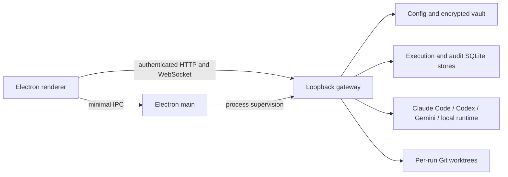

# Architecture

## Context

Daimon OS coordinates coding-agent runtimes on one operator's machine. It must keep concurrent changes observable and reviewable without becoming an inference reseller, hosted workspace, or remote execution service.

## Decision

Daimon OS is a local-first, provider-native orchestration control plane:

- Electron main owns application lifecycle, native dialogs, and the minimal trusted renderer bridge.
- A gateway binds to `127.0.0.1` on an OS-assigned port and authenticates renderer and administrative calls with distinct process-local credentials.
- The gateway launches supported provider CLIs or a local Codex OSS adapter for Ollama and LM Studio.
- Provider and GitHub credentials remain in their native CLI/keyring boundaries.
- Configuration and encrypted secrets live below Electron `userData`; no runtime data is shipped with the application.
- Scheduler-dispatched write-capable workers run in dedicated Git worktrees.
- Review approval is bound to the SHA-256 digest of the captured Git diff.
- Promotion rechecks the artifact, approval, canonical `HEAD`, and working-tree state before applying the approved patch locally.
- No Daimon-owned path commits, pushes, releases, deploys, or sends external messages implicitly.

## Runtime components



The renderer is a static Next.js export served through the custom `app://daimon` protocol. The packaged gateway and MCP adapter are bundled JavaScript resources. `node-pty` remains a native dependency and must match the target Electron ABI and architecture.

## Configuration model

A fresh installation persists neutral settings only. The following collections start empty:

```text
providers, agents, teams, projects, goals, tasks,
skills, MCP servers, secrets, blueprints, schedules, fusion runs
```

The operator creates these objects explicitly through the setup wizard and configuration UI. Factory reset returns to the same empty state and removes stored vault, skill, and attachment content.

## Execution and review

```text
goal or task
  -> Lead planning and delegation
  -> dependency-aware scheduler
  -> isolated worker worktree
  -> captured Git diff and status
  -> waiting_review attention item
  -> exact-hash human approval
  -> local promotion into the canonical checkout
```

Retry creates a new run attempt. A successful agent process is not equivalent to an approved change. Promotion does not create a Git commit and does not push to a remote.

## Persistence

- `config.json` contains non-secret local configuration.
- The AES-256-GCM vault contains secret values; configuration exposes metadata only.
- The execution store records run state, attention items, approvals, and content-addressed evidence.
- The control store records effect receipts, delegation lineage, liveness leases, capabilities, messages, and versioned coordination state.
- The operator audit retains redacted configuration, work, and security metadata for five days.

Local stores are controlled by the current OS account. Hash linking detects some modification but does not make the data independently immutable.

## Security boundaries and failure modes

- A worktree isolates Git changes, not filesystem or network authority. A malicious process can use the current user's permissions.
- Imported repositories, prompts, hooks, skills, MCP servers, and generated code are untrusted.
- Provider-internal tool calls are governed by the provider runtime, not by Daimon's Git promotion receipt.
- Ambiguous promotion state fails closed and requires operator reconciliation.
- Providers that cannot report cost are blocked from unattended budget enforcement rather than silently bypassing a configured project budget.
- Multi-user tenancy, hosted workspaces, enterprise RBAC, and remote execution are outside this architecture.

## Distribution boundary

The source produces a macOS Universal DMG, Windows x64 NSIS installer, and Linux x64 AppImage. Public distribution requires platform signing, macOS notarization, artifact hashes, and clean-machine validation on the target operating system. Cross-built binaries are packaging evidence, not target-runtime acceptance.
