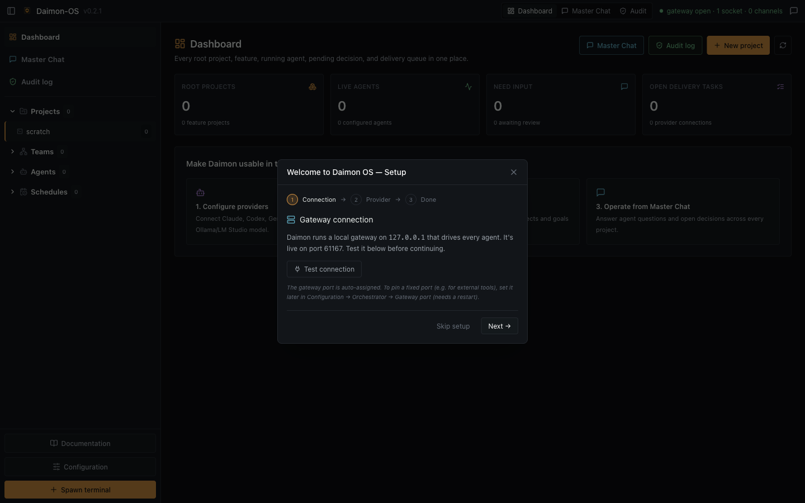
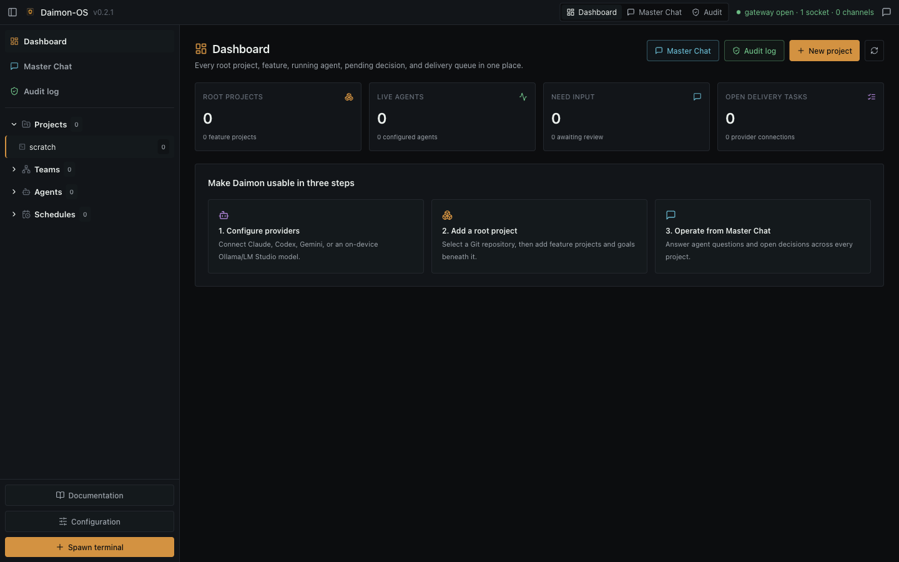
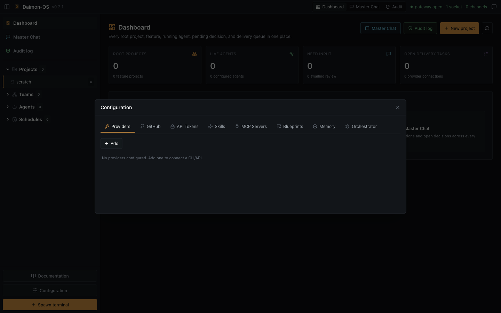
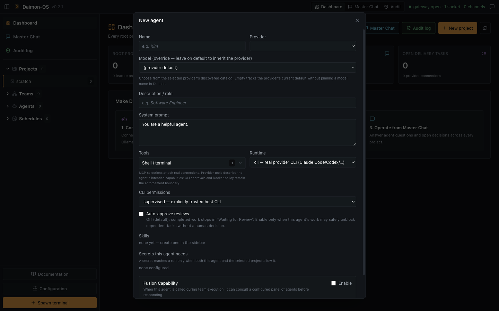
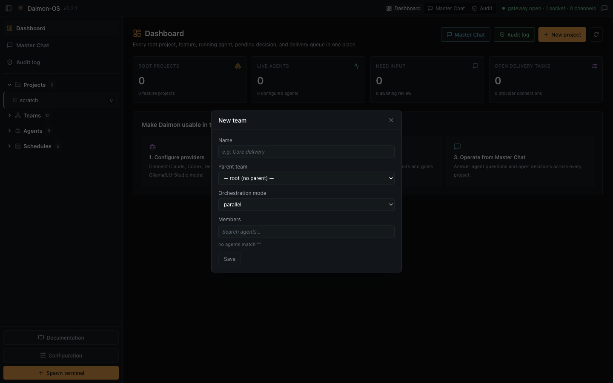
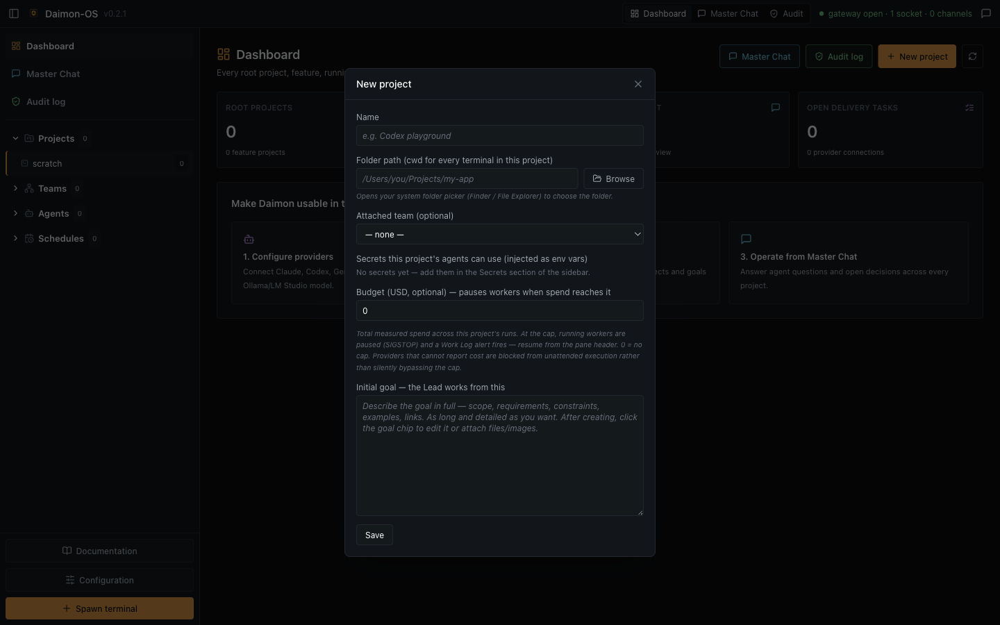
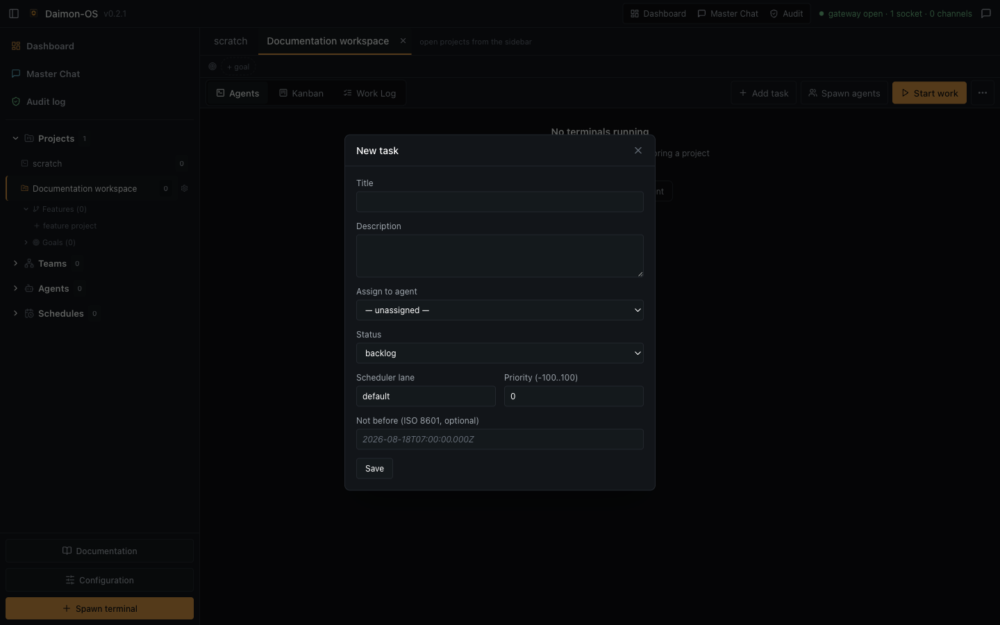
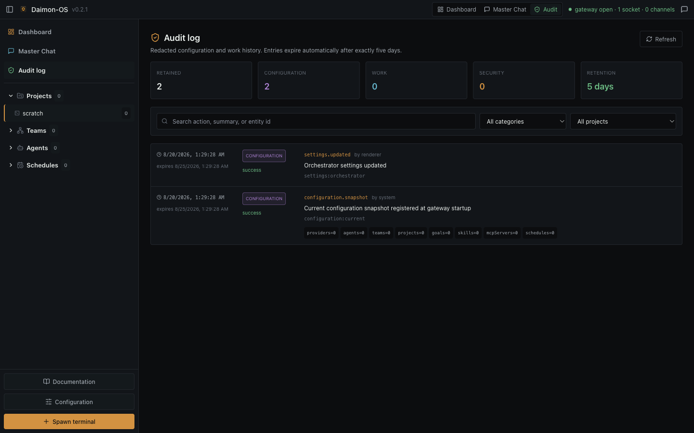

# End-to-end guide

This guide follows the real Daimon OS workflow from an empty first run to reviewed local delivery. Screenshots were captured from the clean community build with a temporary user-data directory. No provider credentials, MCP connections, agents, teams, projects, or tasks are shipped in the application.

## 1. Start from a clean installation

Launch Daimon OS. The desktop starts an authenticated gateway on `127.0.0.1` using an OS-assigned port and opens the setup wizard.

Use **Test connection** to verify the local gateway. This test does not contact an AI provider. Continue to provider setup, or choose **Skip setup** to inspect the empty application first.

The empty dashboard reports zero projects, agents, teams, tasks, and provider connections.

## 2. Configure a provider

Open **Configuration → Providers**. Add one of the supported launch providers:

| Provider path | Prerequisite | Authentication boundary |
|---|---|---|
| Claude Code | `claude` CLI installed | Existing Claude CLI login |
| Codex | `codex` CLI installed | Existing Codex CLI login |
| Gemini | `gemini` CLI installed | Existing Gemini CLI login |
| Ollama | Ollama listening on loopback | Local runtime; Codex OSS drives the tool loop |
| LM Studio | Local server listening on loopback | Local runtime; Codex OSS drives the tool loop |

For a CLI provider, sign in with that provider's own CLI before starting Daimon OS. Daimon does not copy the provider credential into its configuration. Use **Test & discover models** in the setup wizard, or the provider import/discovery controls after setup, to prove the executable and model catalog are reachable.

Do not save a provider as “ready” merely because its name appears in the form. A real connection is proven only by successful discovery or a successful provider process.

## 3. Configure GitHub and optional capabilities

GitHub is optional for local execution. Open **Configuration → GitHub** to inspect the active `gh` account and link an existing accessible `owner/repository` to a root project. Authentication remains in GitHub CLI and the OS keyring. Linking may set the project's canonical `origin` after native confirmation; it does not commit or push.

Configure only capabilities that the agents actually need:

- **API Tokens** — store secret values in the encrypted local vault. Grant a secret to both the project and the agent before it can be injected.
- **Skills** — add reusable instructions and attach them to selected agents.
- **MCP Servers** — configure commands or URLs and then enable each server per agent. Treat every MCP server as executable authority.
- **Memory** — choose a local memory root and validate it before allowing retrieval or writes.
- **Blueprints** — define reusable task dependency graphs.

Least privilege matters: a project grant alone or an agent grant alone is insufficient for a secret; both scopes must allow it.

## 4. Create agents

Expand **Agents** in the left sidebar and use its add control. Create each reusable worker with:

- a unique name and role;
- one configured provider;
- the provider default model or a discovered model override;
- a precise system prompt;
- only the tools, MCP servers, skills, memory access, and secrets it requires;
- `cli` runtime for a real provider process;
- supervised permissions unless a narrower reviewed policy justifies otherwise.

Avoid **Auto-approve review** for agents that can change a repository. Human review of captured evidence is the core control boundary.

## 5. Assemble a team

Expand **Teams** and add a team. Select its members, orchestration mode, and reporting hierarchy.

The Team Lead must be a team member backed by an enabled Claude Code, Codex, or Gemini CLI provider and use the `cli` runtime. The Lead plans and delegates; member agents execute assigned work. `parallel`, `sequential`, and `supervisor` modes affect delegation order, but task dependencies remain authoritative.

## 6. Create a project and goal

Select **New project** from the dashboard. A root project points to an existing local folder that becomes the canonical checkout.

Configure:

1. **Name** — a stable operator-facing project name.
2. **Folder path** — the existing local project or Git repository.
3. **Attached team** — the team that will receive work.
4. **Secrets** — only those required by this project.
5. **Budget** — optional measured-spend stop. Providers without enforceable usage reporting are blocked from unattended execution rather than silently bypassing the limit.
6. **Initial goal** — scope, requirements, constraints, acceptance criteria, and relevant links.

Feature projects may be created under a root project. They share the approved Git root but retain their own goals, tasks, sessions, budgets, and approvals.

## 7. Create or delegate tasks

Open the project and select **Add task** to create a task manually, or select **Start work** to let the Lead decompose the active goal through Daimon's private project-scoped MCP adapter.

For manual tasks, provide a clear title and description, optionally assign an agent, and model dependencies with **Depends on**. The scheduler starts only eligible backlog tasks. Runtime transitions such as `in_progress`, `waiting_review`, and `failed` are server-owned; do not simulate them by editing status records.

`Start work` is valid only when the project has an attached team, a supported Lead, and an actionable goal. The Lead should create explicit tasks and dependencies rather than spawning uncontrolled terminals.

## 8. Observe execution

Each scheduled write-capable run receives its own Git worktree. Use the project view and terminal panes to observe live output and use pause, resume, retry, or terminate controls when needed.

Master Chat has two distinct roles:

- **Needs input** aggregates operator decisions, failures, policy blocks, and review requests from projects.
- **Provider chat** starts an unscoped conversation. It receives no project, agent, MCP, skill, memory, or vault authority.

Do not treat terminal success as delivery. The review state is the delivery gate.

## 9. Review and promote the exact change

When a worker finishes, Daimon captures the full Git diff and status as content-addressed evidence and moves the task to `waiting_review`.

Open the review from the project or Master Chat. Inspect the diff, affected files, base revision, and subject hash. If the result is acceptable, select **Approve exact hash & apply locally**.

Before promotion, Daimon rechecks:

- the captured artifact digest;
- the immutable approval subject;
- canonical `HEAD`;
- canonical working-tree state;
- whether the approved patch still applies without ambiguity.

If any check is uncertain, promotion fails closed. A successful promotion applies the approved patch to the local canonical checkout. It does not commit, push, create a release, or deploy.

## 10. Audit, recovery, and reset

Use **Audit** for the redacted five-day operator view. Prompts, terminal output, source contents, request bodies, and secret values are intentionally excluded.

Use **Configuration → Orchestrator → Reset to factory** when a full local reset is required. The action removes providers, agents, teams, projects, goals, tasks, skills, MCP servers, blueprints, schedules, secrets, attachments, and vault contents, returning to the same empty first-run configuration.

Back up runtime state only through an approved encrypted mechanism. Never copy Electron `userData` into the source repository or an application build.
